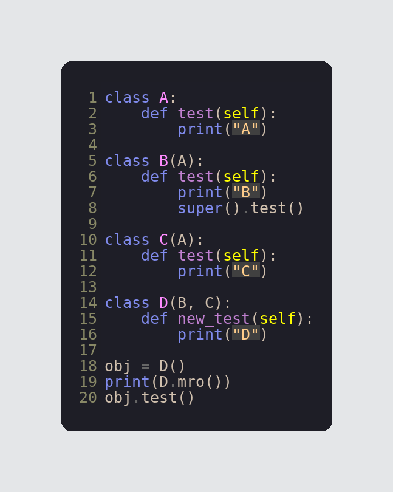

# Bizzare formatter
Easy way to create beautiful images from python code
## Install
`pip3 install git+https://github.com/teadove/bizzare-formatter`
## Examples
inputted code in `example.py`:
```angular2html
class A:
    def test(self):
        print("A")

class B(A):
    def test(self):
        print("B")
        super().test()

class C(A):
    def test(self):
        print("C")

class D(B, C):
    def new_test(self):
        print("D")

obj = D()
print(D.mro())
obj.test()
```
Compile image:<br>
`bizzare-formatter example.py -c=2`<br>
Result:<br>

## Options
```
usage: bizzare-formatter [-h] [-f FILE_OUT] [-c COLOR] [file]

generate beautiful image of python code

positional arguments:
  file                  filename to generate from

optional arguments:
  -h, --help            show this help message and exit
  -f FILE_OUT, --file_out FILE_OUT
                        filename to store in
  -c COLOR, --color COLOR
                        background color, submit number to use prefefined list of color, or nothing, to use them randomly. Otherwise use #FFFFFF notation.

```
