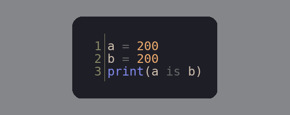

# Bizzare formatter
Easy way to create beautiful images from python code
## Install
`pip3 install git+https://github.com/teadove/bizzare_formatter`
## Examples
inputted code:
```angular2html
a = 200
b = 200
print(a is b)
```
Compile image:<br>
`cat example_2.py | bizzare-formatter -c=4`<br>
Result:
